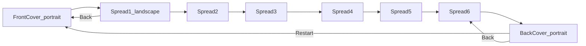

# SSSB v1 Build and Test Plan

## Sources of truth (read these first)

- UX behavior: `[docs/UX_REQUIREMENTS.md](docs/UX_REQUIREMENTS.md)`
- Visual/layout/transitions: `[docs/DESIGN_REQUIREMENTS.md](docs/DESIGN_REQUIREMENTS.md)`
- Repo: `/Users/nkenda/Programming/sssb/app-sssb1` (Flutter package `app_sssb1`)
- Remote: `https://github.com/kenreichl/app-sssb1`
- Flutter SDK: `~/Programming/dev/flutter` (project already created; `lib/main.dart` is still the default counter demo)

## Locked decisions for implementers (resolve doc conflicts)

Use these even if docs conflict slightly:

1. **Page-turn while music playing:** fade audio out over the page-turn duration (DESIGN §3.4.2), finishing before the next page’s audio starts. Do **not** hard-cut mid-turn except the DESIGN edge case (last 1200 ms of song → no fade).
2. **Music Off toggle:** fade out over **1 second**, then clear highlight/autoscroll (UX §5).
3. **No Replay button in v1.** Re-listen = Music Off → On (restarts from 0). Cover Off→On restarts the 3-loop cover track.
4. **Exit:** fade music 1s (if playing), then leave app: Android `SystemNavigator.pop()` / `moveTaskToBack`; iOS call `SystemNavigator.pop()` (no guaranteed kill). Hide status bar for reading UI.
5. `**text_block` coords** are relative to the **fitted artwork rectangle** (letterboxed), not the full screen.
6. **v1 non-goals:** analytics, IAP, swipe page-turn, network dependency, custom Replay control.
7. **Platform targets:** Android API 26+; iOS set to Flutter/toolchain minimum (prefer DESIGN’s iOS 12+ intent; raise only if SDK requires).

## Product shape (8 screens)




| Screen         | Orientation | Artwork                                 | Audio                                                                           | Text                                        |
| -------------- | ----------- | --------------------------------------- | ------------------------------------------------------------------------------- | ------------------------------------------- |
| Cover          | portrait    | `assets/images/artwork_cover_front.jpg` | `assets/audio/00_cover_front_five_little_green_beans.mp3` (loop ×3 then silent) | none                                        |
| Spread N (1–6) | landscape   | `assets/images/artwork_spreadN.png`     | from `text_spreadN.md` frontmatter                                              | lyrics + `timecode_spreadN.json`            |
| Back           | portrait    | `assets/images/artwork_cover_back.jpg`  | `07_cover_back_twinkle.mp3` (play once)                                         | structured sections in `text_cover_back.md` |


## Asset / data contracts

### Spread markdown (`assets/data/text_spreadN.md`)

- YAML frontmatter between `---`: `spread`, `title`, `illustration`, `audio`, `text_block: {x,y,width,height}` (0–1 of fitted art).
- Body: lyric lines; **non-blank lines** in order = `l1`, `l2`, …; blank lines = stanza spacing only.

### Timecode JSON (`assets/data/timecode_spreadN.json`)

- Hybrid schema: `song`, `duration`, `lines[]` with `id` (`l1`…), `start`/`end` (seconds), `text`, `words[{start,end,text}]`.
- Active word at time `t`: first word where `start <= t < end` (or inclusive end on last word). Active line = line containing that word / whose `[start,end)` contains `t`.

### Back cover markdown (`assets/data/text_cover_back.md`)

- Frontmatter: `illustration`, `audio`, `logo`, `author_photo`, `illustrator_photo`, `text_block`.
- Body sections: `## author_bio`, `## illustrator_bio`, `## book_info`.
- Layout order: logo → author photo (circular, `0.28 * text_block.width`) + bio → illustrator photo + bio → book_info. Text insets `0.05 * text_block.width`.

### Image paths in code

Prefix with `assets/images/` (or `assets/audio/`). Photo files use hyphens: `photo-bio-ng.jpg`, `photo-bio-nt.jpg`.

---

## Target architecture

Replace counter demo. Suggested layout:

```
lib/
  main.dart                 # WidgetsFlutterBinding, orientation/status bar bootstrap, runApp
  app.dart                  # MaterialApp + theme (Nunito, colors)
  models/
    book_page.dart          # sealed: CoverPage | SpreadPage | BackCoverPage
    text_block_rect.dart
    lyric_line.dart / lyric_word.dart / timecode_track.dart
    back_cover_content.dart
  data/
    book_catalog.dart       # ordered list of 8 pages + asset path helpers
    content_loader.dart     # load/parse md + json from rootBundle
  state/
    music_preference.dart   # ChangeNotifier + shared_preferences key music_on (default true)
    audio_controller.dart   # single JustAudio player; fade; loop policy; cancel on navigate
    book_navigator.dart     # current index 0..7; forward/back; transition lock
  ui/
    theme/app_theme.dart
    widgets/
      fitted_artwork.dart   # BoxFit.contain, black letterbox, exposes art Rect
      overlay_controls.dart # exit / chevrons / music / restart using safe-area math
      circular_icon_button.dart
      lyric_text_block.dart # scroll + Text.rich highlight + autoscroll
      back_cover_scroll.dart
      page_transition_host.dart
    screens/
      cover_screen.dart
      spread_screen.dart    # one widget parameterized by SpreadPage
      back_cover_screen.dart
      book_shell.dart       # hosts current page + controls + transitions
```

**Comments:** every new Dart file and non-obvious line should have brief comments for a developer new to Flutter (per DESIGN §2).

---

## Dependencies to add (`pubspec.yaml`)

- `just_audio` — playback, seek, volume fade
- `audio_session` — interruptions (call/headphones) → stop + clear highlight
- `shared_preferences` — persist `music_on`
- `yaml` — parse frontmatter (or small custom splitter + `yaml` for the map)
- Bundle **Nunito** under `assets/fonts/` and declare in `flutter: fonts:` (offline; do not rely on `google_fonts` network fetch). Fallback: `fontFamilyFallback` to rounded system sans if files missing during early slice.

Also ensure iOS/Android audio background modes are **not** required (app stops on background).

---

## Build phases

### Phase 0 — Project hygiene (before UI)

- Confirm `flutter pub get`, `flutter analyze` clean baseline.
- Add dependencies + Nunito fonts + asset declarations.
- Add `docs/BUILD_NOTES.md` only if needed; prefer implementing from this plan + UX/DESIGN docs.
- Optional helper script or test: validate each `timecode_spreadN.json` parses and every `id` maps to a non-blank lyric line.

### Phase 1 — Shell + navigation (no audio yet)

- Black scaffold; hide status bar (`SystemChrome.setEnabledSystemUIMode` / overlays).
- `BookShell` with index 0=cover … 7=back.
- Per-route orientation lock via `SystemChrome.setPreferredOrientations` when page changes (portrait cover/back; landscape spreads). Accept temporary sideways hold during transition.
- `FittedArtwork`: `BoxFit.contain`, centered, black bars; compute and expose fitted `Rect` for overlays.
- Controls (DESIGN §3.2.2 formulas using **safe** width/height after `MediaQuery.padding`):
  - `buttonDiameter = max(48, 0.09 * shortestSide)`
  - `edgeGap = max(8, 0.02 * shortestSide)`
  - Exit top-right; chevrons; music; restart on back only.
- Transitions:
  - Cover↔Spread1 and Spread6↔Back and Back→Cover restart: fade via black 200 ms out / 200 ms in; hide chrome during fade; set orientation at fade-in start.
  - Spread↔spread: soft horizontal curl/flip illusion ≤1200 ms; animate text-block size with `AnimatedContainer` 200–400 ms.
- Ignore extra chevron taps while a transition is in progress.

**Exit Phase 1 when:** can open app on cover, walk Cover→1→…→6→Back→Restart→Cover with correct orientations and no stuck nav.

### Phase 2 — Content loading + static text

- Implement `ContentLoader` for spread md + back cover md.
- `LyricTextBlock`: white `#FFFFFF` @ 10% fill, no border; typography DESIGN §3.7 (`#1A1A1A`, line height 1.35; phone 18–22 / tablet 24–28 when `shortestSide >= 600`).
- Position text block using fitted-art rect × frontmatter `text_block`.
- Manual scroll works with music conceptually “off”.
- Back cover scroll: logo + circular photos + section text.

**Exit Phase 2 when:** all spreads show correct lyrics/layout; back cover shows bios/credits.

### Phase 3 — Thin vertical slice audio + highlight (PRIORITY)

Implement full audio/highlight stack and **prove it on:**

**Cover → Spread 1 (music + word highlight + autoscroll) → Spread 2 → (navigate 3–6) → Back cover**

Minimum slice validation path for daily testing: **Cover → Spread 1 → Spread 2 → jump forward to Back** is OK only if Spreads 3–6 already use the same `SpreadScreen` (they should). Prefer exercising real forward nav through all pages once the slice works.

Audio controller rules:

- Single player instance; cancel/replace on navigation.
- Cover: start ~200 ms after init if music On; loop exactly 3 times then silent (preference stays On).
- Spreads/back: start ~50 ms after transition completes if music On; from 0:00.
- Page leave: fade out completing by transition end (DESIGN); then load next.
- Music Off: 1s fade, clear highlight, keep scroll offset.
- Music On: start current page audio from 0 + highlight.
- App pause/interrupt: stop audio; clear highlight state; keep preference.
- Missing audio: silent; UI remains usable.
- Position stream → resolve active word → rebuild `TextSpan`s (active: bold + `#2E7D32`).
- Autoscroll active line to upper-middle; manual scroll pauses autoscroll **2 seconds**, then resume.

**Exit Phase 3 when:** thin-slice checklist below passes on a device or simulator.

### Phase 4 — Polish + harden

- Preload adjacent page images.
- Image load failure → title/fallback + Continue (cover) / still allow nav on spreads.
- Soft curl polish within 1200 ms budget; keep latency low.
- Expand unit/widget tests; run full acceptance criteria from UX §11.

### Phase 5 — Remaining spreads confidence

- Spot-check spreads 3–6 timing/layout (same code path; content-only issues fixed in assets, not code).

---

## Visual tokens (implement exactly)

- Accent highlight: `#2E7D32`
- Lyric text: `#1A1A1A`
- Text block wash: `#FFFFFF` @ 10% opacity
- Background letterbox: black
- Buttons: circular, translucent; Material Icons OK for exit/chevrons/speaker/restart if custom assets absent (keep large hit targets)

---

## Test and iteration plan

### Strategy

1. **Data checks** every change (fast).
2. **Unit/widget tests** for pure logic.
3. **Thin vertical slice manual QA** every implementation day.
4. **Full book QA** before calling v1 done.
5. Separate **code bugs** vs **content bugs** (timecode/md/coords).

### A. Automated data checks (script or `test/data_validation_test.dart`)

For N=1..6:

- JSON parses.
- Non-blank lyric count == distinct expected `l1…lN` coverage used by timecode (every timecode `id` exists; warn on unused lyric lines).
- Referenced audio/image files exist under `assets/`.
- Frontmatter contains `text_block` with 0–1 ranges.
- Back cover contains `## author_bio`, `## illustrator_bio`, `## book_info` and photo/logo files exist.

### B. Unit tests

- Active word lookup at sample timestamps (including gaps → no highlight).
- Music preference default true; persists via mocked `SharedPreferences`.
- Nav edges: cannot go back from cover / forward from back.
- Text-block rect mapping: given art rect + normalized block → expected `Rect`.

### C. Thin vertical slice manual checklist (daily gate)

Run on one phone or tablet simulator (landscape/portrait as locked):

1. Cold launch → portrait cover; music starts ~200 ms if preference On.
2. Toggle music Off/On on cover → stops/restarts 3-loop behavior.
3. Forward → fade via black → landscape Spread 1; prior audio gone; Henrietta starts ~50 ms after transition.
4. Words highlight in sync (`#2E7D32` bold); text block autoscrolls.
5. Manual scroll during music → autoscroll pauses ~2s then resumes.
6. Forward to Spread 2 → audio fades/crosses cleanly; new song + highlight; no overlap.
7. Continue to Back cover (via 3–6 or after slice is green) → portrait; credits scroll; twinkle plays once if On.
8. Restart → cover; book starts at beginning.
9. Kill app and relaunch → music preference remembered; always start on cover (not mid-book).
10. Rapid chevron mashing → no freeze, no two songs at once, transitions ignore re-entry.
11. Background app during Spread 1 → audio stops; return not stuck highlighted.

### D. Full acceptance (UX §11) before v1 sign-off

Walk all spreads with music On and Off; verify song end does not auto-advance; failures of missing audio still allow reading; Exit fades then leaves app on Android.

### E. Iteration cadence

- After each phase exit criteria: fix blockers before adding features.
- Content timing issues → edit `timecode_spreadN.json` / `text_spreadN.md`, not highlight engine.
- Keep a short punch list: Blocker / Polish / Later.
- Optional debug overlay (debug builds only): page index, music On, audio position, active `lineId`/`word`.

### F. Device matrix (before release candidate)

- Small phone, large phone, one tablet.
- iOS + Android if toolchains available (note: full iOS/Android SDKs may still need installing on this machine; use available devices first, e.g. macOS/Chrome only for non-orientation smoke, then real devices for orientation locks).

---

## Implementation order reminder for a new agent

1. Read UX + DESIGN docs + this plan.
2. Phase 0–1 shell/nav/transitions.
3. Phase 2 static content.
4. **Phase 3 thin slice audio+highlight** until checklist passes.
5. Phase 4–5 polish + full acceptance.
6. Do not implement analytics/IAP.

## Key files the agent will create/touch

- Replace `[lib/main.dart](lib/main.dart)`
- Add tree under `lib/` as above
- Update `[pubspec.yaml](pubspec.yaml)` (deps + fonts)
- Possibly `ios/Runner/Info.plist` / Android manifest for orientations
- Tests under `test/`
- Do not rewrite assets unless fixing validation failures

